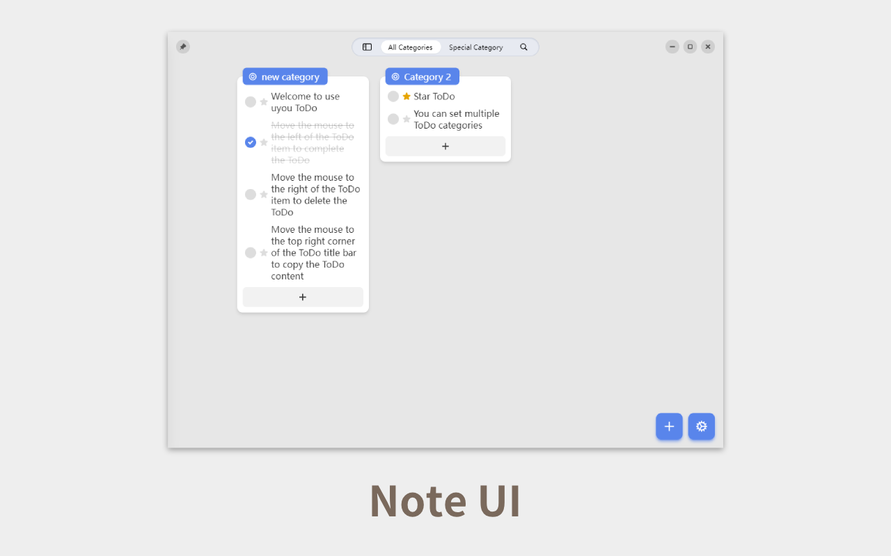

# uyou-todo-electron


[](https://github.com/tonylu110/uyou-todo-electron/releases)


English | [中文简体](https://github.com/tonylu110/uyou-todo-electron/blob/main/README/zh_cn.md)

## Run and build

- run in development mode
  ```bash
  pnpm i
  pnpm electron:serve // run in Windows
  pnpm electron:servemac // run in mac or Linux
  ```
- build
  ```bash
  pnpm i
  pnpm electron:build // build for Windows
  pnpm electron:buildmac // build for mac or Linux
  ```

## Preview





## Font

If you want to use the built-in fonts before 2.1.3, you can click the link below

[Smartisan T Regular](https://github.com/tonylu110/uyou-todo-electron/releases/download/2.1.3/Smartisan_Compact-Regular.ttf) |
[Smartisan T Bold](https://github.com/tonylu110/uyou-todo-electron/releases/download/2.1.3/Smartisan_Compact-Bold.ttf)

## Sponsor

<p float="left">
  
  
<p/>

## Star History

[](https://star-history.com/#tonylu110/uyou-todo-electron&Date)
