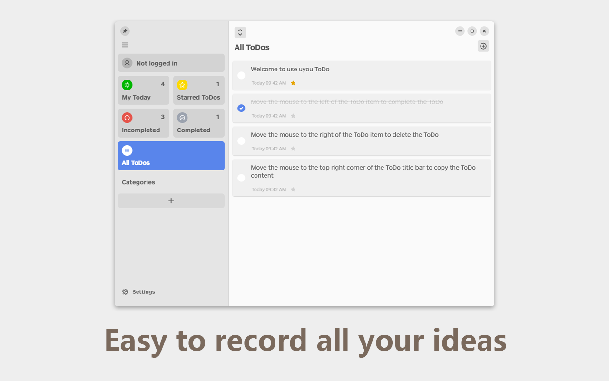
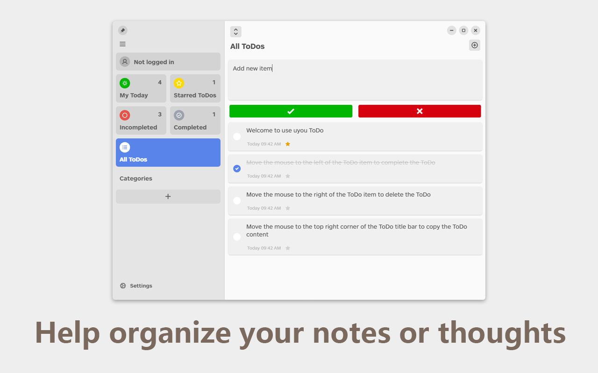
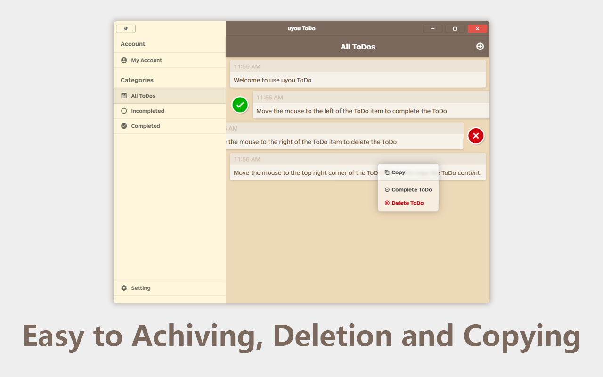

# uyou-todo-electron


[](https://github.com/tonylu110/uyou-todo-electron/releases)


English | [中文简体](https://github.com/tonylu110/uyou-todo-electron/blob/main/README/zh_cn.md)

## Run and build

- run in development mode
  ```bash 
  pnpm i
  pnpm electron:serve // run in Windows
  pnpm electron:servemac // run in mac
  ```
- build
  ```bash
  yarn
  yarn electron:build // build for Windows
  yarn electron:buildmac // build for mac 
  ```

## Preview






