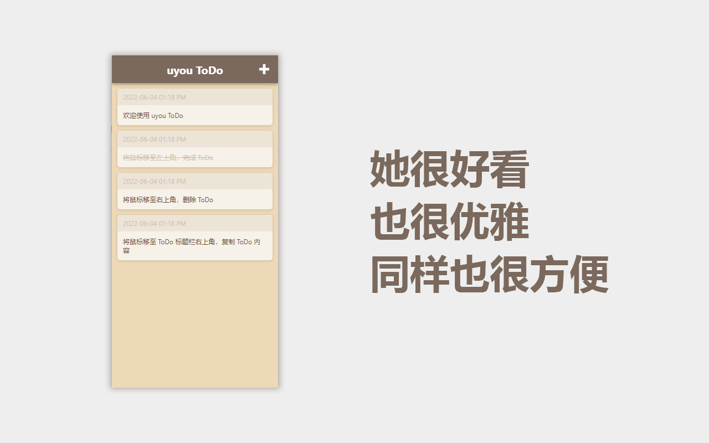
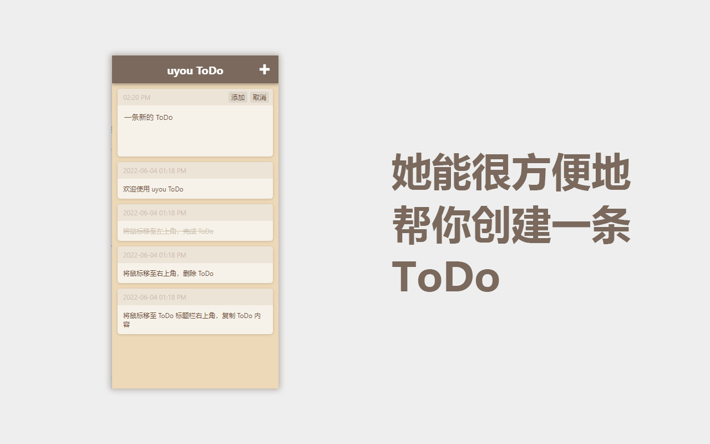
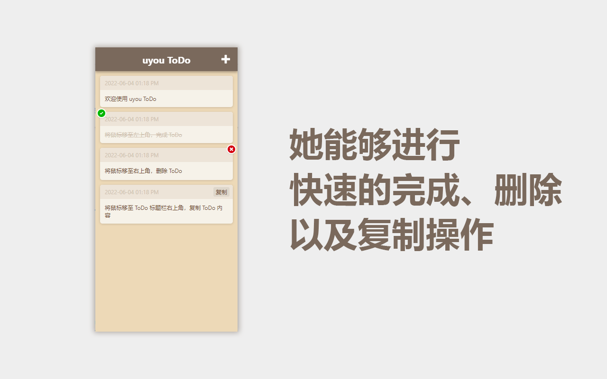

# uyou-todo-electron
 
[English](https://github.com/tonylu110/uyou-todo-electron) | 中文简体

## 运行与编译 

- 开发运行
    ``` 
    yarn
    yarn electron:serve
    ```
- 编译
  ```
  yarn
  yarn electron:build
  ```

## 预览



